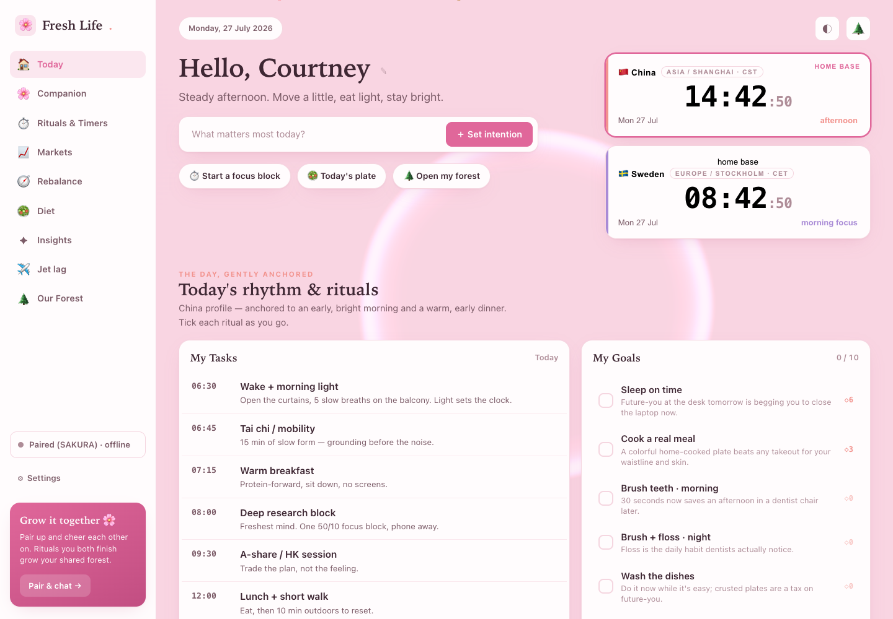
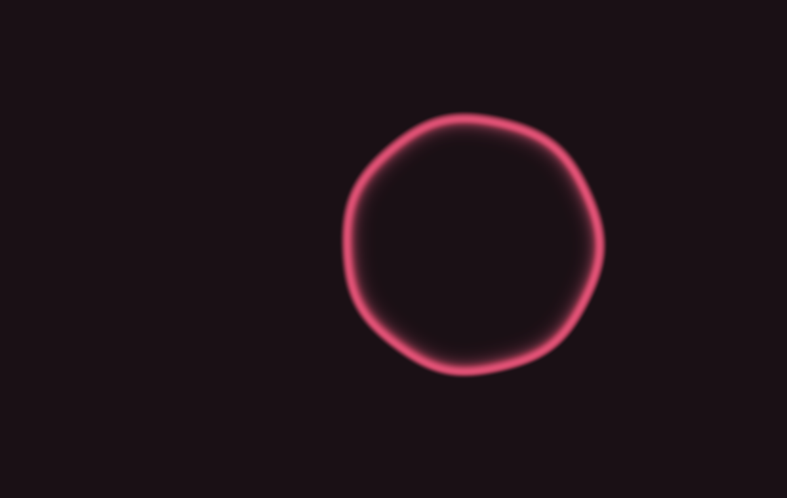
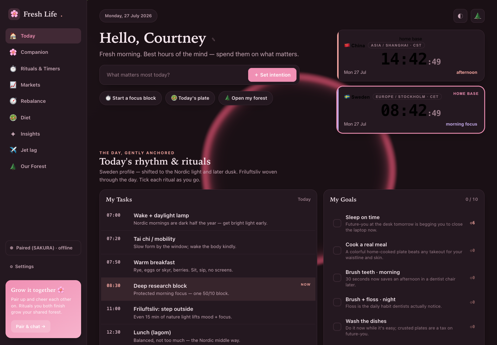
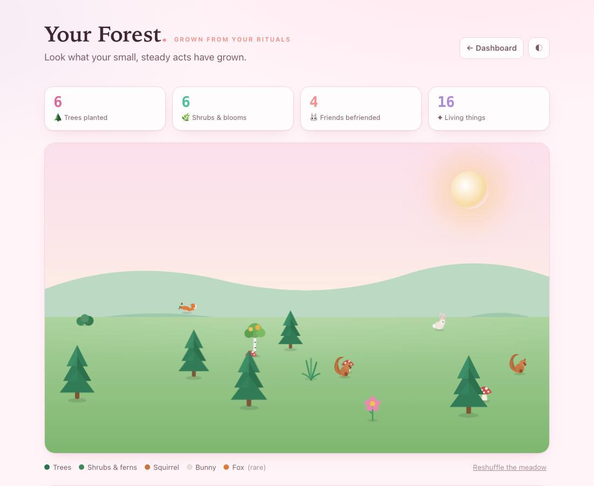

<div align="center">

# 🌸 Fresh Life

**A calm, colorful daily-ritual dashboard for a sharp mind and a steady body — built for a life lived between two time zones.**

*Anchor your day, grow a little forest of tiny wins, do it together with someone you love, and lean on a gentle AI companion when you need a nudge.*

[Live demo](https://diamondcao1996.github.io/mond/) · [Report an issue](https://github.com/DiamondCao1996/mond/issues)

</div>

---



## Why this exists

Life between China and Sweden means two clocks, jet lag, odd market hours, and a schedule that never quite sits still. **Fresh Life** is a single, soothing home base for the small daily things that keep you healthy and focused — sleep, movement, food, focus blocks, skincare — anchored to whichever country you're actually living in right now.

It's deliberately **kind, not naggy**: small repeatable rituals, gentle nudges, a no-guilt way back when the day goes sideways, and rewards that celebrate showing up rather than punishing the miss.

## ✨ What it does

- **🕰️ Two live clocks** — China & Sweden, DST-safe. Tap one to switch your whole day's rhythm to that region's profile.
- **🏠 Today's rhythm** — a region-aware timeline that highlights *now*, plus ten daily rituals with streaks and a progress bar.
- **⏱️ Ritual timers** — yoga, tai chi, a forest run, facial care, a 50/10 focus block… each with steps and a gentle chime. 15 minutes is enough.
- **📈 Markets, in your local times** — live open/closed status for US, HK and China A-shares, each session translated into both your wall-clocks so you know when to sit down and when to sleep instead.
- **🧭 Interruption rebalance** — lost a night, ate late, worked a midnight US session? Pick what threw you off and get a calm, science-based way back.
- **🥗 A rotating, lighter menu** — a 7-day weight-loss plan blending Chinese and Nordic kitchens.
- **✈️ Jet-lag reset plans** — light-timing strategy for crossing the ~7 hours in either direction.
- **🌲 A reward forest** — every ritual or finished timer plants a tree in [`garden.html`](garden.html). Keep going and bunnies, squirrels, and the occasional fox move in. It only ever grows.
- **💞 Two-person mode** — pair with someone you love and cheer each other on (see below).
- **🌸 A gentle AI companion** — encouragement and a kind read on your patterns, powered by Claude (see below).
- **🌀 A living sakura halo** — a glowing ring ([Vanta.js HALO](https://www.vantajs.com/?effect=halo) / WebGL) drifts behind the whole dashboard, tinted to the theme (a rose halo over plum at night, a soft rose glow by day), with blossom petals floating over it. It bows out gracefully if you prefer reduced motion.



<table>
<tr>
<td width="50%"></td>
<td width="50%"></td>
</tr>
<tr>
<td align="center"><em>Twilight sakura night mode, halo aglow</em></td>
<td align="center"><em>The reward forest — grown from your rituals</em></td>
</tr>
</table>

## 🤝 Doing it together (global collaboration)

Fresh Life is lovelier with two.

1. Open the **Companion** section (or the pairing chip in the sidebar).
2. One of you taps **Create shared space** and gets a six-letter code.
3. The other enters that code under **Join their space**.

You then sync **directly, device-to-device, over the internet** — a live *Together* card shows both people's rituals, streaks, and forest, wherever you both are.

> **Privacy by design:** collaboration is peer-to-peer over WebRTC ([PeerJS](https://peerjs.com/)). Your progress travels straight between the two browsers — **nothing is stored on a server**. Both of you need to be online at the same time to sync live; the connection reconnects on its own.

## 🌸 The AI companion

A warm, emotionally-intelligent companion that blends gentle psychology with evidence-based habit and health coaching. It already knows how your day is going (region, rituals done, streaks, today's intention, and your partner's progress if paired) and offers encouragement, notices patterns kindly, and suggests one or two doable next steps.

**Set it up:** open **⚙ Settings** → paste a [Claude API key](https://console.anthropic.com/) → chat.

- Calls the [Claude API](https://docs.claude.com/) **directly from your browser** using the `anthropic-dangerous-direct-browser-access` header. Default model: **Claude Opus 4.8** (changeable in Settings).
- Your API key is stored **only in your browser's `localStorage`** — never uploaded to us, never committed, never shared with your partner.

> ⚠️ It's a caring AI, **not** a medical professional. In a crisis, contact local emergency services or a helpline.

## 🏗️ Architecture

Fresh Life is a **zero-build static site** — plain HTML, CSS, and vanilla JavaScript. No framework, no bundler, no `npm install`. It runs by opening a file, and deploys by copying files. State lives in the browser (`localStorage`), and the only network calls are the optional peer connection and the optional Claude request.

```
fresh-life-site/
├── index.html              # the dashboard — a clean semantic document
├── garden.html             # the reward-forest page
├── assets/
│   ├── css/
│   │   ├── tokens.css       # design system: colour tokens, radius, type (base + sakura theme, light/dark)
│   │   ├── base.css         # the wellness components (clocks, timeline, habits, timers, markets, diet, tips…)
│   │   ├── app.css          # the app shell (sidebar, hero), collaboration & companion UI, modals
│   │   └── garden.css       # self-contained styles for the forest scene
│   └── js/
│       ├── app.js           # the engine: state, storage, time helpers, and every render function
│       ├── shell.js         # the chrome: editable name, daily intention, sidebar nav, mobile menu
│       ├── companion.js     # two-person P2P pairing + the Claude AI companion
│       └── garden.js        # the reward forest (SVG trees & critters, grows per completed ritual)
├── docs/screenshots/       # images for this README
├── LICENSE
└── README.md
```

**How the layers fit together**

- **Design tokens first.** Everything is themed through CSS custom properties. The entire sakura palette (and its dark variant) is a small override block in [`tokens.css`](assets/css/tokens.css) — reskinning the whole app is a matter of a dozen colour values.
- **Scripts share a tiny global surface.** [`app.js`](assets/js/app.js) owns the single source of truth — a `state` object persisted to `localStorage` under one key (`freshlife.v1`) — plus `save()` and a few data tables (`HABITS`, `SCHEDULES`, `TIMERS`, `MARKETS`, `DIET`, `TIPS` …). [`shell.js`](assets/js/shell.js) and [`companion.js`](assets/js/companion.js) build on those globals; they're loaded in order as classic scripts, so the dependency order is just the `<script>` order.
- **Time is IANA-correct.** Clocks, schedules, and market sessions all go through DST-safe helpers built on `Intl.DateTimeFormat`, so nothing drifts when the clocks change.
- **The forest is pure SVG.** No image assets — trees, bunnies, squirrels, and foxes are drawn inline and scattered with a little depth math, so it stays crisp and tiny.

## 🚀 Run it

**Locally** — it's a static site, so any of these work:

```bash
# simplest: just open it
open index.html

# or serve it (nicer for testing relative asset paths)
python3 -m http.server 8000    # then visit http://localhost:8000
```

**Deploy (GitHub Pages)** — push to `main`, then in the repo go to **Settings → Pages → Deploy from a branch → `main` / `root`**. Your site goes live at `https://<user>.github.io/<repo>/`.

## 🔒 Privacy & data

- All your progress is stored **locally in your browser** (`localStorage`), never on a server.
- Collaboration is **peer-to-peer**; your data flows only between the two paired devices.
- The Claude API key you enter stays in your browser and is sent only to Anthropic's API on the requests you trigger.
- **Reset today's data** any time from the footer.

## 🧰 Built with

Vanilla JS · CSS custom properties · `Intl` for timezones · [Vanta.js](https://www.vantajs.com/) + [three.js](https://threejs.org/) for the animated background · [PeerJS](https://peerjs.com/) (WebRTC) for pairing · [Claude API](https://docs.claude.com/) for the companion · Web Audio for the timer chime. No frameworks, no build step.

## 📝 Note

General wellness guidance grounded in circadian, nutrition, and exercise research — **not** personalized medical advice.

## 📄 License

[MIT](LICENSE) © Huizhong Cao

<div align="center">

*Made with ♥ for a fresh, healthy, focused life.* 🌸

</div>
